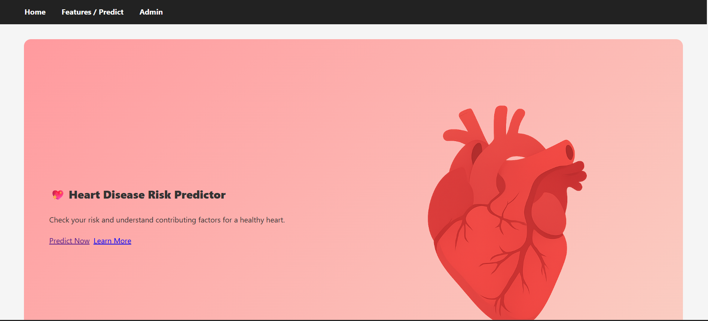
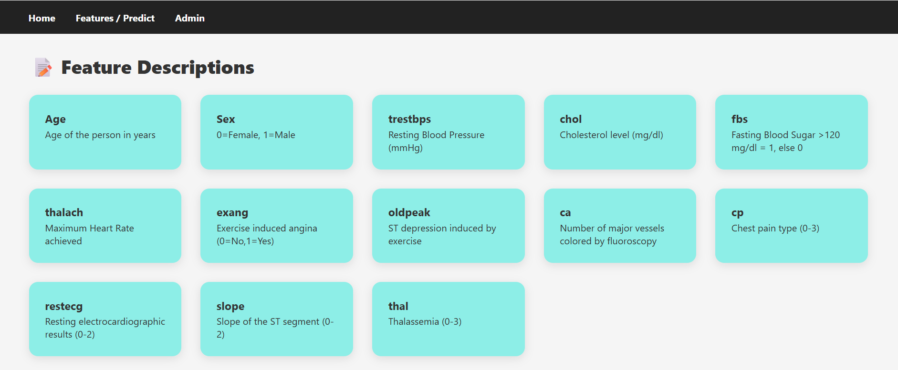
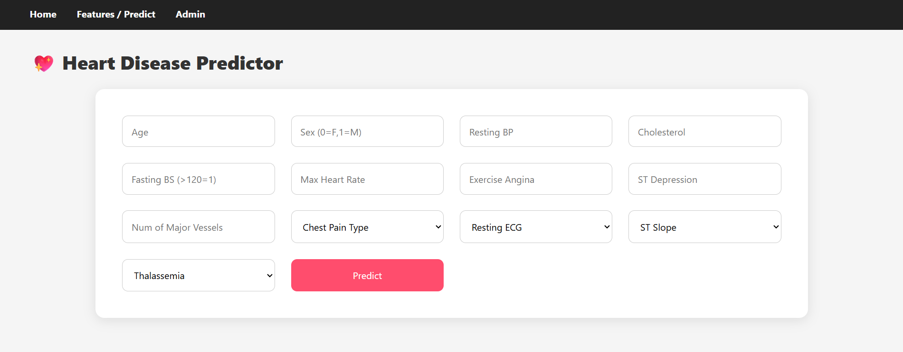
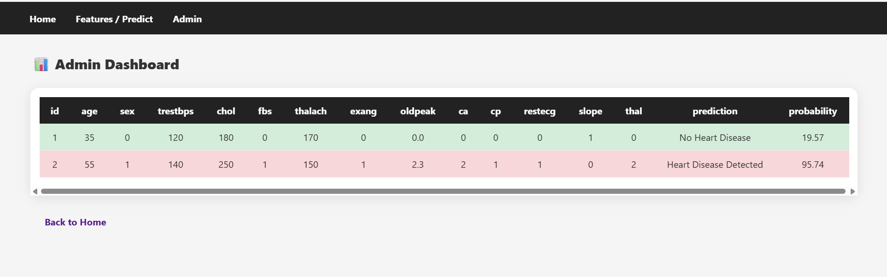

## 🫀 Heart Disease Prediction App

An interactive web application built with Flask that predicts the likelihood of heart disease based on user inputs such as age, gender, chest pain type, blood pressure, cholesterol level, and more. The app uses a machine learning model trained on heart disease datasets to provide accurate predictions.

🚀 Features

User-friendly web interface (Flask + HTML + CSS).

Machine Learning model trained with scikit-learn.

Input form for patient details.

Instant prediction with result visualization.

Admin dashboard to view input records.

🛠️ Tech Stack

Backend: Python, Flask

Frontend: HTML, CSS, Jinja2 Templates

ML: scikit-learn, pandas, numpy

Deployment: Render / Railway / Heroku

📂 Project Structure
Heart_Disease_Project/
│
├── app.py                  # Main Flask app

├── heart_disease_model.pkl # Saved ML model

├── requirements.txt        # Dependencies

├── templates/              # HTML templates

├── static/                 # CSS, Images

⚡ Installation & Usage

Clone the repository:

git clone https://github.com/<your-username>/Heart_Disease_Project.git
cd Heart_Disease_Project

Create and activate virtual environment:

python -m venv venv
venv\Scripts\activate   # On Windows
source venv/bin/activate  # On Mac/Linux

Install dependencies:

pip install -r requirements.txt

Run the app:

python app.py

Open in browser:

http://127.0.0.1:5000

📸 Screenshots

🧑‍💻 Author

👩‍💻 Developed by Geetanjali Singh

⭐ Contribute

Pull requests are welcome! For major changes, please open an issue first to discuss what you would like to change.

